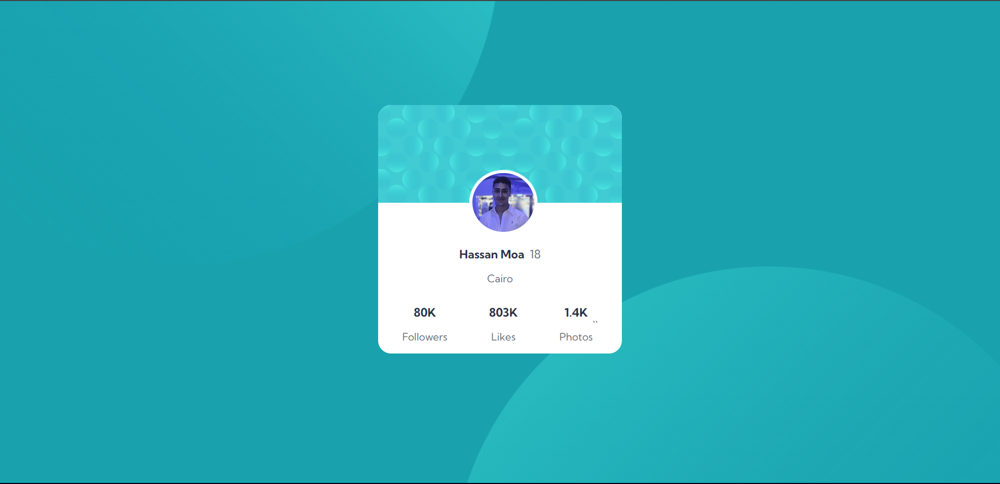
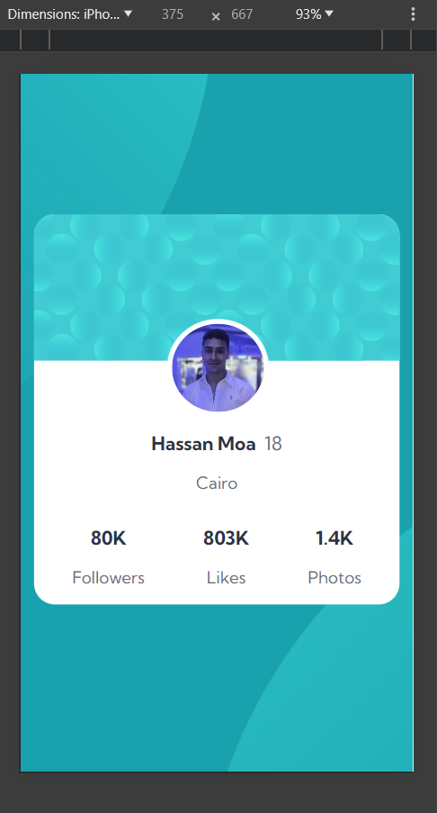

# Frontend Mentor - Profile card component solution

This is a solution to the [Profile card component challenge on Frontend Mentor](https://www.frontendmentor.io/challenges/profile-card-component-cfArpWshJ). Frontend Mentor challenges help you improve your coding skills by building realistic projects.

## Table of contents

- [Overview](#overview)
  - [The challenge](#the-challenge)
  - [Screenshot](#screenshot)
  - [Links](#links)
- [My process](#my-process)
  - [Built with](#built-with)
  - [What I learned](#what-i-learned)
  - [Continued development](#continued-development)
  - [Useful resources](#useful-resources)
- [Author](#author)

## Overview

### The challenge

- Build out the project to the designs provided

### Screenshot




### Links

- Solution URL: ()
- Live Site URL: ()

### Built with

- Semantic HTML5 markup
- CSS custom properties
- Flexbox
- Google Fonts

### What I learned

I learned using background-position & background-repeat to position the background-top and bottom correctly as the design

I also refreshed my css skills by doing this project as everyday i'm delighted for a new different challenge! In this case, it was about using flexbox in order to create responsive layout.

```
    body {

    background-image: url(images/bg-pattern-top.svg), url(images/bg-pattern-bottom.svg);
    background-position: right 50vw bottom 40vh, left 45vw top 55vh; /* positions for the images */
    background-repeat: no-repeat, no-repeat; /* makes sure the images only appear once */
}

    .profile-img {

    width: 28%;
    border-radius: 50%;
    border: 5px solid white;
    position: absolute;
    left: 127px;
    top: 100px;
}

```

### Continued development

- I want to learn more about css by creating multi-page websites

### Useful resources

- (https://github.com/Neel-07/Profile-Card-Component.git) - Got inspired by Neel's solution for the background-images position as i didn't experience using them before, i did play with the properties after and got them well!

- (https://www.w3schools.com) - W3S helped me getting some help!

## Author

- Frontend Mentor - [@hassanmoaa](https://www.frontendmentor.io/profile/hassanmoaa)
